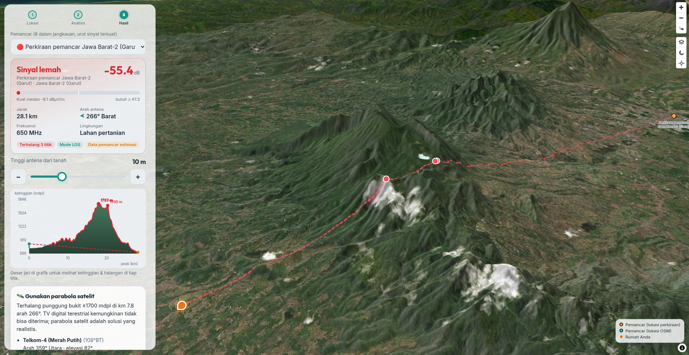
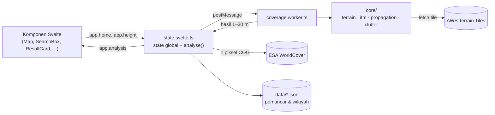

# Cek Sinyal TV Digital

Web GIS untuk memperkirakan kuat sinyal TV digital (DVB-T2) di atap rumah di Indonesia, berdasarkan lokasi rumah, tinggi antena, dan kontur tanah. Semua perhitungan berjalan di browser; tidak ada server.

**Coba:** [tv-digital.hanatek.id](https://tv-digital.hanatek.id) · Preview branch `dev`: [habib-roy.github.io/indonesian-digital-tv-coverage](https://habib-roy.github.io/indonesian-digital-tv-coverage/)



> Hasilnya **estimasi model**, bukan hasil ukur. Lihat [docs/metode.md](docs/metode.md) untuk metode, sumber data, dan keterbatasan.

## Fitur

- Cari alamat / pakai lokasi / ketuk peta → analisis 5 langkah dengan progres jelas
- Model propagasi **ITM (Longley-Rice)** port dari NTIA + clutter **ITU-R P.2108** dari ESA WorldCover
- Slider tinggi antena 1–30 m, grafik profil jalur dengan zona Fresnel dan titik halangan
- Peta 3D terrain, heatmap cakupan, pilihan peta dasar (satelit, jalan, topografi), mode terang/gelap
- Rekomendasi antena (ukuran Yagi) atau parabola jika sinyal terestrial tidak ada
- Cetak / simpan PDF hasil analisis
- Mobile first

## Mulai

Butuh Node sesuai [.nvmrc](.nvmrc) dan pnpm.

```sh
nvm use
corepack enable      # pnpm dari packageManager di package.json
pnpm install         # juga memasang git hooks (.githooks/)
pnpm dev             # http://localhost:5173
```

| Perintah                      | Fungsi                                                                            |
| ----------------------------- | --------------------------------------------------------------------------------- |
| `pnpm dev`                    | Dev server                                                                        |
| `pnpm build` / `pnpm preview` | Build produksi ke `dist/`                                                         |
| `pnpm check`                  | Semua pemeriksaan: prettier, eslint (0 warning), svelte-check, tes, validasi data |
| `pnpm format`                 | Rapikan format                                                                    |
| `node scripts/build-data.ts`  | Bangun ulang `data/` dari Wikipedia + OpenStreetMap                               |

Hook `pre-commit` memeriksa format & lint file yang di-stage; `pre-push` menjalankan `pnpm check`.

## Struktur

```
src/
  config.ts              ← SEMUA pengaturan yang bisa diubah (URL layanan, batas analisis, peta, UI)
  App.svelte             ← kerangka: peta + wizard 3 langkah + modal + tata letak cetak
  app.css                ← token tema (terang/gelap) & utilitas
  lib/
    state.svelte.ts      ← state global (Svelte 5 runes) + orkestrasi analisis
    coverage.worker.ts   ← Web Worker: terrain, ITM, heatmap (semua kerja berat)
    components/          ← komponen UI
    core/                ← logika murni tanpa DOM, bisa dites di Node
      itm.ts             ← port ITM NTIA (jangan ubah tanpa tes referensi)
      propagation.ts     ← kuat medan & margin, parameter receiver
      clutter.ts         ← ITU-R P.2108 + kelas WorldCover
      terrain.ts         ← tile Terrarium → profil ketinggian
      fresnel.ts         ← analisis geometri jalur untuk grafik
      advisor.ts, yagi.ts← rekomendasi & dimensi antena
data/                    ← pemancar & wilayah layanan (JSON, divalidasi)
docs/                    ← metode (tampil juga di modal aplikasi), issue awal
scripts/                 ← build & validasi data
test/                    ← node:test, termasuk referensi ITM dari C++ NTIA
```

## Arsitektur

Aplikasi statis (tanpa backend). Semua data diambil browser langsung dari layanan terbuka; perhitungan berat berjalan di Web Worker agar UI tetap lancar di ponsel.



1. Pengguna memilih lokasi → `app.home`.
2. `analyse()` memilih ≤ 8 pemancar terdekat (≤ 150 km), membaca tutupan lahan di titik rumah.
3. Worker mengambil profil ketinggian tiap jalur dan menjalankan ITM + P.2108 **untuk semua tinggi antena 1–30 m sekaligus**, jadi slider tidak perlu menghitung ulang.
4. Komponen membaca `app.analysis`; heatmap dihitung terpisah untuk area yang terlihat.

Detail model: [docs/metode.md](docs/metode.md).

## Kontribusi

Lihat [CONTRIBUTING.md](CONTRIBUTING.md) dan [Kode Etik](CODE_OF_CONDUCT.md). Paling dibutuhkan: laporan lapangan dan data lokasi menara ([issue awal](docs/initial-issues.md)).

## Lisensi

- Kode: [MIT](LICENSE)
- Data di `data/`: [CC BY-SA 4.0](data/LICENSE) (Wikipedia dan OpenStreetMap)
- Semua sumber data, standar, font, dan library: [ATTRIBUTION.md](ATTRIBUTION.md)
